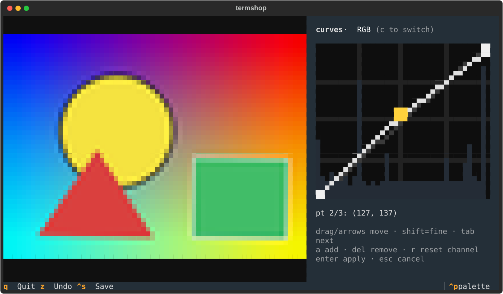

# termshop

**A photo editor that lives in your terminal.**

**[Website](https://termshop.pranavpatil6251.workers.dev)**

`macOS` · `Linux` · `Windows` — Python 3.10+

Open a real photo in your terminal, crop it with the mouse, drag tone curves
with live preview, straighten the horizon, batch-export a whole folder — no
GUI, no Electron, just a terminal.

- **Real pixels** in kitty & Ghostty (kitty graphics protocol), sixel in
  WezTerm/iTerm2, unicode half-block fallback everywhere else — auto-detected
- **Non-destructive**: edits are an op pipeline previewed on a downscaled
  copy, replayed at full resolution on save
- **Curves editor** (Fritsch–Carlson monotone cubic, per RGB channel, live
  histogram), tone & white-balance controls, aspect-locked crop, straighten
  with auto-crop
- **Culling workflow**: browse a directory, per-photo edit history, edits
  auto-persist to a `.termshop.json` sidecar across restarts
- **Batch CLI**: export every sidecar edit, or copy one photo's recipe onto
  hundreds of files
- **Clipboard in/out**: paste a screenshot in, copy the edited result out

## Install

One-liner (macOS / Linux):

    curl -fsSL https://21prnv.github.io/termshop/install | bash

Or pick your tool (all platforms, including Windows):

    uv tool install git+https://github.com/21prnv/termshop.git
    pipx install git+https://github.com/21prnv/termshop.git
    pip install git+https://github.com/21prnv/termshop.git

Optional extras:

| OS | For clipboard paste (`V`) |
|---|---|
| macOS | `brew install pngpaste` (copy out works out of the box) |
| Linux (Wayland) | `wl-clipboard` |
| Linux (X11) | `xclip` |

Best experience in [kitty](https://sw.kovidgoyal.net/kitty/) or
[Ghostty](https://ghostty.org) (true pixel rendering). Any truecolor terminal
works via half-blocks; force a backend with `--renderer tgp|sixel|half`.

## Use

    termshop photo.jpg          # edit one photo
    termshop ~/Pictures         # browse & cull a directory

### Keys

| Key | Action |
|---|---|
| `c` | crop — drag mouse, `enter` apply, `esc` cancel, `x` aspect lock (1:1, 4:3, 3:2, 16:9) |
| `r` / `e` | rotate 90° cw / ccw · `f` / `v` flip |
| `,` / `.` | straighten ±0.5° (`<` / `>` ±0.1°), auto-crops the wedges |
| `k` | curves editor — `c` channel, click/drag points, `enter` apply |
| `B/b` `N/n` `S/s` `P/p` | brightness / contrast / saturation / sharpness ± |
| `D/d` `H/h` `J/j` | gamma / shadows / highlights ± |
| `T/t` `M/m` | white balance warm/cool · tint magenta/green |
| `g` `a` `u` `i` | grayscale · autocontrast · blur · sharpen |
| `+` `-` `0` | zoom (or mouse wheel) · reset; arrows or drag to pan |
| `\` | before/after toggle |
| `[` / `]` / `o` | prev / next photo / file browser |
| `z` / `y` | undo / redo |
| `Y` / `V` | copy edited image to clipboard / paste clipboard as new photo |
| `ctrl+s` / `w` / `W` | save copy / save as / export (max size + quality) |
| `q` | quit |

The sidebar shows a live RGB histogram, the op history, and your position in
the directory. Unsaved edits survive restarts via the sidecar.

## Run it in a browser

    pip install 'termshop[web]'
    termshop-web ~/Pictures            # http://localhost:8000

Serves the real app over a websocket (textual-serve). `--host`, `--port`, and
`--public-url` (for reverse proxies) are supported.

## Batch mode

    termshop --commit ~/Pictures              # export all sidecar edits
    termshop --commit ~/Pictures --clear      # ...and mark them done
    termshop --apply best.jpg *.jpg           # copy one photo's recipe
    termshop --apply ops.json pics/ -o out/ --max-side 1600 --quality 80

Outputs never overwrite inputs. `--suffix`, `-o/--outdir`, `--quality`,
`--max-side` control naming and size.

## Development

    git clone https://github.com/21prnv/termshop.git && cd termshop
    python3 -m venv .venv && .venv/bin/pip install -e .
    PYTHON=.venv/bin/python ./run_tests.sh

Tests are plain scripts under `tests/` that drive the app headlessly through
Textual's Pilot — no pytest required.

## License

MIT
